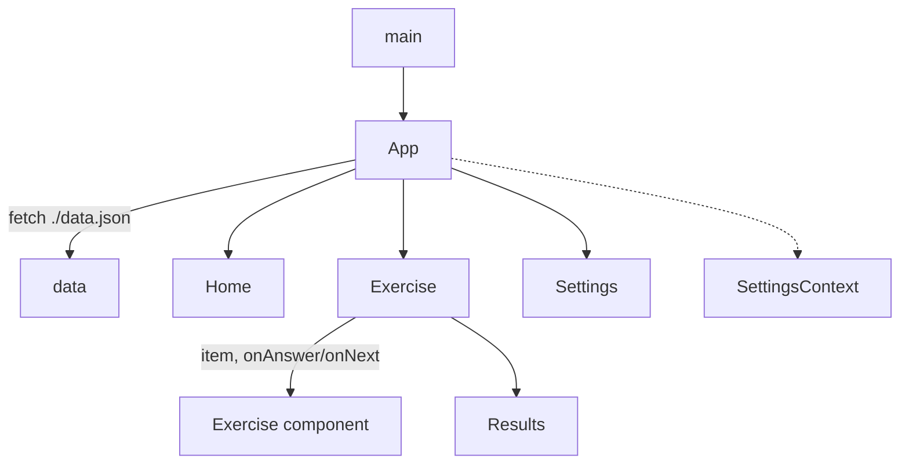

# Repository Guidelines

## Project Overview
`cz-tut` ("Čeština") is a Czech-language learning trainer: a **client-only React 19 + Vite 6 single-page app**, installable as an offline PWA. There is no backend — all learning content ships as a static `public/data.json`. The app presents six exercise types across CEFR levels A1–C1 with a lightweight adaptive-difficulty engine, and persists settings/scores in `localStorage`.

## Architecture & Data Flow
- **Boot** (`src/main.jsx`): imports `index.css`, mounts `<App>` into `#root` via `ReactDOM.createRoot(...).render(<React.StrictMode>…)`, and registers `./sw.js` on `window.load` (guarded by `'serviceWorker' in navigator`).
- **Shell & routing** (`src/App.jsx`): hand-rolled — **no router library**. Holds three pieces of state: `view` (`'home' | 'exercise' | 'settings'`), `exercise` (`{ type }`), and the fetched `data`. Navigation is conditional rendering keyed off `view`; the header back button shows when `view !== 'home'`, the ⚙︎ button toggles `settings`/`home`.
- **Data load**: `App.jsx` runs `fetch('./data.json')` once in `useEffect` and passes the parsed object down as the `data` prop. Views/exercises receive data via **props** — they never import the JSON.
- **Adaptive engine** (`src/views/Exercise.jsx`): the core logic.
  - Difficulty split: `EASY_LEVELS = ['A1','A2']`, `HARD_LEVELS = ['B1','B2','C1']`.
  - Each pooled item is annotated `{ exerciseType, level, direction }` where `direction` is a random `'en-cz' | 'cz-en'`. `type === 'mixed'` concatenates pools across all exercise types; otherwise a single type's pool. `possessives` reuses `ChooseWord` (see `COMPONENTS` map).
  - A session starts with `BATCH_SIZE = 12` shuffled easy items. The last `WINDOW_SIZE = 6` results are tracked; when recent accuracy ≥ `PROMOTE_THRESHOLD = 0.8` and hard items remain, one hard item is appended to the queue.
  - On completion, `saveScore(type, 'adaptive', Math.round(score/total*100))` records the best percentage; `<Results>` renders score + Home/Try-again.
- **State/persistence**: `src/SettingsContext.jsx` provides `{ settings, update }` via context (default `{ theme: 'auto' }`); persists to `localStorage['cz-settings']` and drives the `data-theme` attribute on `<html>`. Scores persist to `localStorage['cz-scores']` (`utils.js`).



## Key Directories
- `src/` — application core (`App.jsx`, `main.jsx`, `SettingsContext.jsx`, `utils.js`, `index.css`).
- `src/views/` — top-level screens: `Home.jsx`, `Exercise.jsx`, `Settings.jsx`.
- `src/exercises/` — the five exercise components (interchangeable units): `Flashcards`, `ChooseWord`, `ChooseLetter`, `Accents`, `ConfusedWords`.
- `src/components/` — shared UI (`Results.jsx`).
- `public/` — static assets served verbatim: `data.json` (content), `manifest.json`, `sw.js`, `icons/`.
- `dist/` — Vite build output (generated; do not edit).

## Development Commands
Package manager is **npm** (only `package-lock.json` present). No global tools required beyond Node.
```bash
npm install        # install deps
npm run dev        # Vite dev server (HMR)
npm run build      # production build -> dist/
npm run preview    # serve the built dist/
npm start          # build + preview (vite build && vite preview)
```
There are **no lint, format, or test scripts** (no ESLint/Prettier/Vitest/Jest config in the repo).

## Code Conventions & Common Patterns
- **Components:** function components with hooks only; default-exported, one per file, PascalCase filenames matching the component. No TypeScript, no prop-types.
- **Exercise contract (important):** every exercise component receives the same props from `Exercise.jsx`, rendered as `<Component key={index} item={item} direction={item.direction} onAnswer={…} onNext={…} />`, and destructures what it needs:
  - `item` — the current question object (shape varies by type, see schema below).
  - `onAnswer(correct: boolean)` — signal a graded answer (`ChooseWord`, `ChooseLetter`, `Accents`, `ConfusedWords`).
  - `direction` + `onNext(known: boolean)` — used only by `Flashcards` (`'en-cz' | 'cz-en'`).
  - `key={index}` forces a fresh mount per question.
  - **To add an exercise type:** add data under `data.exercises[key]` (`label`/`icon`/`description`/`items`), create the component honoring this contract, and register it in the `COMPONENTS` map in `src/views/Exercise.jsx`.
- **Answer-feedback convention (reuse, do not reinvent):**
  - Option buttons toggle CSS classes `option-btn correct` / `option-btn wrong` once `answered`: mark the correct option `correct`, the chosen-but-wrong option `wrong`.
  - The word/answer display colors via inline `color: var(--success)` / `var(--error)`.
  - When both a textbox and buttons exist (`ChooseLetter`), only the input method actually used shows border feedback — tracked via `usedButton`/`selectedIdx` so the unused control stays neutral.
  - Advance timing in `Exercise.jsx`: correct answers advance after `700ms`, wrong after `1500ms`; flashcards advance immediately.
- **Randomness:** `utils.shuffle` (Fisher–Yates, returns a shallow copy). MCQ components shuffle options locally inside `useMemo(…, [item])` and recompute the correct index (`correctIdx`) — never mutate `item`.
- **Styling:** plain CSS in a single `src/index.css`, class-based (ad-hoc semantic names, not BEM/utility). Theme via CSS custom properties under `:root` (`--bg`, `--bg-card`, `--text`, `--text-muted`, `--accent`, `--accent-hover`, `--success`, `--error`, `--border`, `--radius`, `--shadow`, `--font`). Dark mode is dual: OS-driven `@media (prefers-color-scheme: dark)` (suppressed by `:root[data-theme="light"]`) plus an explicit `[data-theme="dark"]` override. `theme: 'auto'` removes the attribute and defers to the OS. Always reference tokens, never hard-coded colors.
- **Error handling:** intentionally silent/best-effort — `localStorage` and `fetch` access wrapped in `try/catch { /* noop */ }` or `.catch(() => …)`. Match this tolerant style for client-only persistence.
- **State:** local `useState` per component; lift only what `Exercise.jsx` must orchestrate.

## Data Model (`public/data.json`)
Top-level keys: `meta` (`{ version, lastUpdated }`), `levels` (`["A1","A2","B1","B2","C1"]`), and `exercises`. Each `exercises[type]` is `{ label, icon, description, items }`, where `items` is keyed by level → array of records. Registered types: `flashcards`, `chooseWord`, `chooseLetter`, `accents`, `confusedWords`, `possessives`.
```jsonc
// flashcards
{ "front": "hello", "back": "ahoj" }
// chooseWord  (and possessives — same shape)
{ "question": "How do you say 'cat' in Czech?", "options": ["kočka","pes","pták","ryba"], "correct": 0 }
// chooseLetter
{ "word": "d_kuji", "missing": "ě", "position": 1, "options": ["e","ě","é","a"], "hint": "thank you" }
// accents
{ "plain": "dekuji", "correct": "děkuji", "accents": [{ "pos": 1, "from": "e", "to": "ě" }] }
// confusedWords
{ "question": "...", "options": ["být","byt"], "correct": 0, "explanation": "..." }
```
`correct` is the zero-based index into the **unshuffled** `options`; components shuffle locally and remap before grading. `data.json` is served **network-first** by the service worker, so content can update without a redeploy. There is **no build-time data step** — `public/` is copied verbatim; edit `public/data.json` directly.

## Important Files
- `src/main.jsx` — entry point + service-worker registration.
- `src/App.jsx` — view routing, data fetch, header.
- `src/views/Exercise.jsx` — adaptive pool building, scoring, component registry (`COMPONENTS`).
- `src/SettingsContext.jsx` — settings context (`{ settings, update }`) + `data-theme` application.
- `src/utils.js` — `shuffle(arr)`, `saveScore(type, level, pct)`, `resetProgress()` (keys `cz-scores` / `cz-settings`).
- `src/components/Results.jsx` — score summary; message thresholds at 80/50.
- `public/data.json` — all learning content.
- `public/sw.js` — PWA caching (`CACHE_NAME = 'cestina-v1'`; bump on shell changes).
- `vite.config.js` — `base: './'` (relative paths, required for the PWA), `build.outDir: 'dist'`, `@vitejs/plugin-react`.
- `index.html` — `#root` mount, manifest/theme-color/icon links, loads `/src/main.jsx`.
- `public/manifest.json` — `standalone`/`portrait`, relative icon/start_url paths, `theme_color #1a73e8`.

## Runtime/Tooling Preferences
- **Node + npm.** ESM throughout (`"type": "module"`). Declared deps: React `^19.0.0`, react-dom `^19.0.0`; dev: Vite `^6.0.0`, `@vitejs/plugin-react` `^4.0.0`. (Note: `package-lock.json` currently resolves newer majors — Vite 8.x, React 19.2.x; treat the lockfile as source of truth for installs.)
- No `engines` pin or `.nvmrc`; use a current LTS Node (Vite 6+ expects Node 18+/20+).
- `vite.config.js` uses `base: './'` — keep all asset/SW/manifest paths **relative** (`./data.json`, `./sw.js`, `./icons/…`) so the build works from any subpath and offline.
- No build-time data step: `public/` is copied verbatim; edit `public/data.json` directly to change content.

## Testing & QA
- No automated test suite or framework is configured. Verify changes manually via `npm run dev`.
- For PWA/offline or service-worker changes, validate with `npm run build && npm run preview` (the dev server bypasses production SW behavior), and **bump `CACHE_NAME` in `public/sw.js`** whenever shell assets change, or stale assets are served from cache.
- Smoke checklist after edits: each exercise type renders and grades correctly, the progress bar/score updates, adaptive promotion still fires (≥80% over the last 6 answers), theme switching works (`auto`/`light`/`dark`), and a hard reload still loads offline.
